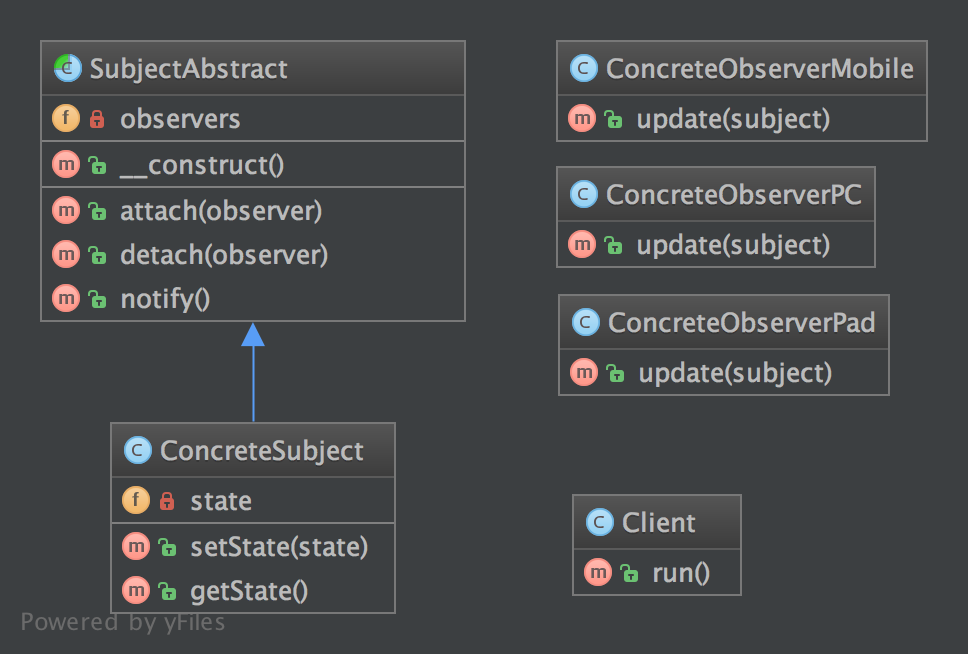

# SplObserver

PHP already defines two interfaces that can help to implement this
pattern: [SplObserver](https://www.php.net/manual/en/class.splobserver.php) and [SplSubject](https://www.php.net/manual/en/class.splsubject.php).

## UML Diagram

